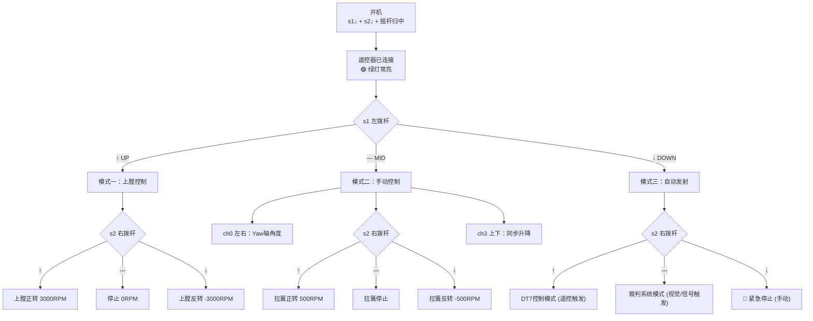

# 2. DT7 遥控器操作指南

> 基于代码自动生成，最后更新：2026.3.26 (已更新重构术语)

## 遥控器布局

```
  [s1]   [ch3 ↕]    [ch1 ↕]   [s2]
         [ch2 ↔]    [ch0 ↔]
 左拨杆   左摇杆      右摇杆   右拨杆
```

- **拨杆 s1 / s2**：三档位（UP ↑ / MID — / DOWN ↓）
- **摇杆通道**：范围约 -660 ~ +660

---

## 开机连接流程

| 步骤 | 操作 | 说明 |
|------|------|------|
| 1 | s1 ↓ + s2 ↓ + 所有摇杆归中 | 系统确认遥控器已连接 |
| 2 | 绿灯由闪烁变为常亮 | 连接成功标志 |

> ⚠️ 连接前系统处于紧急停止状态，所有电机目标值为 0

---

## 模式切换（s1 左拨杆）

| s1 位置 | 模式 | 说明 |
|---------|------|------|
| **↑ UP** | 上膛电机控制 | 控制上膛 M3508 的转速 (复位/装填) |
| **— MID** | 手动控制 | 手动操控拉簧、升降、Yaw 轴 |
| **↓ DOWN** | 自动发射 | 进入自动发射/视觉控制流程 |



---

## 详细操作说明

### 1. 手动锁定机制 (ManualCtrlLock)
为了防止在切换模式或操作摇杆时出现不可控的电机转速大跳变，系统引入了 `ManualCtrlLock`（控制权锁定）：
- **锁定触发**：进入手动模式或切换子状态时，若摇杆不在死区内，锁定生效。
- **解锁操作**：将相关摇杆（ch1, ch3）及拨杆（s2）归中，即可解除锁定，恢复控制。

### 2. 手动模式 (s1 —)
- **Yaw 轴控制**：通过右摇杆 `ch0` 左右推。目标角度会持续累加。
- **升降控制**：通过左摇杆 `ch3` 上下推。左右升降电机同步运动，系数 0.5。
- **拉簧控制**：通过右拨杆 `s2`。控制拉簧电机的正反转速度。

### 3. 自动模式 (s1 ↓)
- **急停位**：将 `s2` 拨至 **DOWN ↓** 位会立即重置所有发射计数器并归零电机转速。

---

## 指示灯说明

| 灯色 | 状态 | 含义 |
|------|------|------|
| 🟢 绿灯 | 常亮 | 遥控器已连接 |
| 🟢 绿灯 | 闪烁 | 待连接状态 |
| 🔴 红灯 | 常亮 | 裁判系统通信正常 |
| 🔴 红灯 | 闪烁 | 裁判系统通信异常 |
