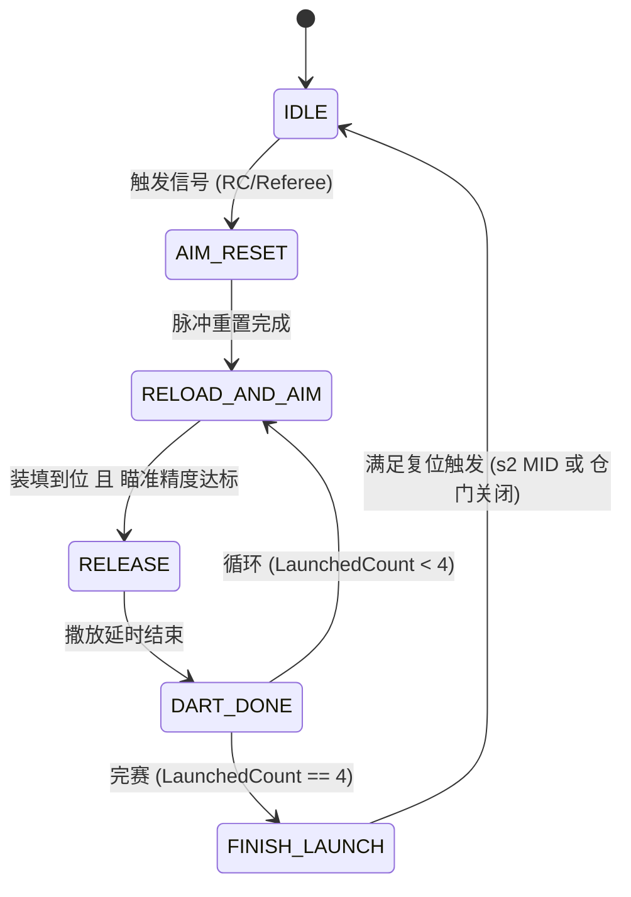

# 3. 自动发射状态机核心逻辑

## 1. 概述
`AutoLaunch` 模块负责控制飞镖发射架的 **4 发连续全自动发射**。核心设计采用 **瞄准与装填并行** 的双轨架构，旨在最大限度减小每发飞镖之间的发射间隔。

## 2. 主状态机总览

### 状态说明：
- **IDLE**: 待命状态，清理所有标志位。
- **AIM_RESET**: 在每发开始前向视觉发送重置信号，防止上一发的旧指令导致误发射。
- **RELOAD_AND_AIM**: **核心状态**。同时推进“装填子状态机”和“视觉瞄准逻辑”。
- **RELEASE**: 舵机 3 动作，物理释放飞镖。
- **DART_DONE**: 单发后续处理（如升降台上升归位）。

## 3. 并行执行机制 (RELOAD_AND_AIM)

在 `RELOAD_AND_AIM` 状态下，系统每个周期 (1ms) 都会同时运行两条轨道：

### 🎯 轨道 A：视觉瞄准
1. **获取数据**：调用 `VisionControl()` 更新最新偏移量。
2. **位置闭环**：Yaw 轴电机根据视觉指令进行快速响应。
3. **精度判定**：
   - 必须满足 `DetectFlag == 3`（视觉锁死目标）。
   - 必须满足 `AimingFinishCount` 达到设定阈值（确保角度稳定）。
   - `hasAimedThisDart` 标志位确保在当前发次内确实有过一次成功的瞄准动作。

### 🔧 轨道 B：装填子状态机 (ReloadSubState)
装填轨独立于瞄准轨进行串行推演：
1. **PLATFORM_UP**: 归位升降台（第 2/3/4 发前序动作）。
2. **SLIDE_DART**: 推镖伺服动作（第 3/4 发动作）。
3. **DOWN_PARALLEL**: **时间优化点**。上膛电机下行寻找限位的同时，升降台同步下降。
4. **RELOAD_UP**: 上膛电机上升寻找合拢限位。
5. **PLATFORM_CHECK**: 到顶位置检查。

> **优势**：总装填瞄准时间 = `max(装填时间, 瞄准时间)`，而非两者相加。

## 4. 关键控制参数

| 变量名 | 推荐值 | 说明 |
| :--- | :--- | :--- |
| `LIFT_SPEED` | 4000 | 升降台 M3508 运行转速 |
| `LOAD_SPEED` | 3500 | 上膛电机 M3508 运行转速 |
| `RELEASE_WAIT` | 500ms | 舵机撒放后的机械延迟 |
| `SLIDE_WAIT` | 400ms | 拨镖机构的脉冲宽度 |

## 5. 紧急停止与恢复
- **s2 == DOWN** 或 **裁判系统信号丢失** 会强行将状态机拉回 `IDLE`。
- 回到 `IDLE` 后，所有电机转速立即归零，`LaunchedCount` 清零。
